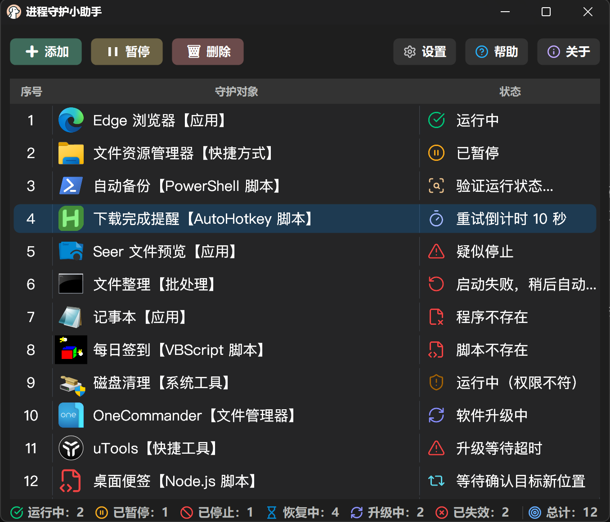

<div align="center">
  

  <p><a href="../README.md">简体中文</a> · <a href="./README.zh-HK.md">繁體中文（香港）</a> · <a href="./README.zh-TW.md">繁體中文（台灣）</a> · <a href="./README.en.md">English</a> · <a href="./README.ja.md">日本語</a> · <a href="./README.vi.md">Tiếng Việt</a> · <a href="./README.ko.md">한국어</a> · <a href="./README.es.md">Español</a> · <strong>Français</strong> · <a href="./README.pt-BR.md">Português</a> · <a href="./README.ru.md">Русский</a> · <a href="./README.de.md">Deutsch</a> · <a href="./README.it.md">Italiano</a></p>

  <h1>Assistant de surveillance des processus</h1>

  <p><strong>Gardez vos applications et automatisations essentielles stables au quotidien</strong></p>

  <p>
    <a href="https://github.com/realSilasYang/process-watchdog/releases/latest"></a>
    <a href="https://github.com/realSilasYang/process-watchdog/releases"></a>
    <a href="https://github.com/realSilasYang/process-watchdog/actions/workflows/ci.yml"></a>
    <a href="../LICENSE"></a>
    
  </p>

  <p>
    <a href="#aperçu-de-linterface">Interface</a> ·
    <a href="#guide-dutilisation">Guide</a> ·
    <a href="#3-états-et-rétablissement">États</a> ·
    <a href="https://github.com/realSilasYang/process-watchdog/releases">Versions</a> ·
    <a href="./CHANGELOG.en.md">Historique</a> ·
    <a href="https://github.com/realSilasYang/process-watchdog/issues/new/choose">Signaler un problème</a> ·
    <a href="#guide-de-développement">Développement</a>
  </p>
</div>

L’Assistant de surveillance des processus s’adresse aux applications de bureau, scripts et raccourcis qui doivent rester disponibles pendant de longues périodes dans la session Windows en cours. Après un arrêt inattendu, il rétablit automatiquement et prudemment la cible en distinguant un arrêt confirmé d’un état momentanément indéterminé, afin d’éviter les lancements erronés ou en double. Toutes les décisions, tous les réglages et tous les journaux restent sur l’ordinateur. Le projet est construit avec AutoHotkey v2 x64 et prend en charge Windows 10 et Windows 11.

L’assistant ne s’appuie pas uniquement sur le nom du processus. Il recoupe le chemin complet, l’identité de création du processus, la cible réelle du raccourci et les indices de ligne de commande. Lorsque les éléments sont insuffisants, il attend la vérification suivante au lieu de considérer un état inconnu comme un arrêt.

Le projet propose une interface claire ou sombre, le rétablissement automatique, la protection pendant les mises à jour, un journal d’exécution, l’annulation et le rétablissement, des noms et icônes personnalisés, ainsi qu’un paquet Windows x64 assorti d’un SBOM SPDX, de sommes SHA-256 et d’une provenance de compilation.

# Aperçu de l’interface

<p align="center">
  
</p>

La fenêtre principale réunit l’ordre des cibles surveillées, l’icône, le nom, les privilèges requis et l’état courant. La barre de commandes propose Ajouter, Supprimer, Suspendre, Réglages, Aide et À propos ; Aide ouvre le mode d’emploi, le journal d’exécution ou la page de retours, tandis qu’À propos regroupe version, environnement, mises à jour, projet et Donner. La barre inférieure récapitule les cibles actives, en rétablissement, en mise à jour, suspendues ou en échec, tandis que le journal expose les indices à l’origine de chaque état anormal.

## Points forts

- Surveille les cibles EXE, AHK, Python, JavaScript, PowerShell, BAT, CMD et LNK.
- Utilise les résultats `Running`, `Stopped` et `Unknown` ; un état inconnu ne déclenche jamais un redémarrage à l’aveugle.
- Attribue à chaque cible son propre contrôleur, sa génération et ses jetons de tâche. Les anciens rappels deviennent immédiatement invalides après une suspension, une suppression ou un changement de chemin.
- Peut exiger les droits administrateur. Une instance active dont les droits ne conviennent pas est signalée, et le prochain lancement surveillé est élevé conformément au réglage.
- La protection des mises à jour est désactivée par défaut. Une fois activée, elle combine processus de mise à jour, relations parent-enfant, activité du dossier d’installation et stabilité des fichiers avant de suspendre ou reprendre la surveillance.
- Remplace la configuration de manière atomique. Les enregistrements impossibles à analyser sont déplacés vers `[Recovery]` plutôt que perdus silencieusement.
- La recherche d’applications utilise exclusivement le service Everything, sans analyse locale de tout le disque ni limite de résultats imposée par l’application. Les grands ensembles sont ajoutés par petits lots pour éviter que l’extraction d’icônes ne monopolise l’interface.
- Prend en charge le chinois simplifié, le chinois traditionnel de Hong Kong, le chinois traditionnel de Taïwan, l’anglais, le japonais, le vietnamien, le coréen, l’espagnol, le français, le portugais du Brésil, le russe, l’allemand et l’italien. L’interface suit par défaut la langue de Windows, revient à l’anglais pour une langue non prise en charge et peut être choisie dans Affichage. La langue et la police du contenu sont appliquées immédiatement au processus courant sans arrêter ni réinitialiser la surveillance.
- Avec « Suivre la valeur par défaut de la langue », seules les polices installées dans Windows sont utilisées : d’abord PingFang, SF Pro Text, Harano Aji Gothic ou Apple SD Gothic Neo, puis la famille Noto correspondante et enfin une police système Windows. Les polices facultatives doivent d’abord être installées dans Windows ; l’assistant ne les charge jamais depuis son propre dossier. La police de contenu couvre le corps du texte, les champs, les listes et les informations À propos ; les boutons, onglets et la barre inférieure utilisent toujours la police d’interface Windows en gras adaptée à la langue.
- Les thèmes clair et sombre prennent en charge la réduction indépendante des fenêtres secondaires, la reconstruction des icônes selon le DPI, les boutons arrondis et les icônes personnalisées.
- Le diagnostic est produit localement et n’est jamais envoyé automatiquement ; les artefacts officiels peuvent être vérifiés indépendamment.

## Périmètre

L’assistant convient aux applications, scripts et raccourcis ordinaires qui doivent rester actifs dans la session de bureau Windows en cours et être rétablis après un arrêt inattendu. Sont hors périmètre :

- Les services Windows, pilotes, composants du noyau ou services couvrant plusieurs sessions utilisateur.
- Windows 7, Windows 32 bits et les systèmes autres que Windows.
- Les systèmes temps réel stricts, grappes à haute disponibilité ou orchestrations nécessitant une isolation de sécurité.
- Une politique agressive qui assimile de force tout état de processus inconnu à un arrêt.

Une exécution complète de l’automatisation GUI est documentée sous Windows 11 à 200 % de DPI réels, et les calculs de rendu sont couverts par régression à 100 % et 300 %. Les vérifications visuelles manuelles à chaque échelle, les changements continus de DPI entre écrans et le contraste élevé restent non vérifiés et ne doivent pas être déduits du seul code. Consultez les [preuves de validation GUI](../tests/gui/VALIDATION-EVIDENCE.en.md) et [Compatibilité et limites connues](en/compatibility.md).

---

**[Guide d’utilisation](#guide-dutilisation)**<br>
[Installation](#1-installation-et-premier-démarrage) · [Gestion](#2-ajout-et-gestion-des-éléments) · [États](#3-états-et-rétablissement) · [Mises à jour](#4-protection-pendant-les-mises-à-jour) · [Réglages](#5-réglages) · [Journaux](#6-journaux-diagnostic-et-confidentialité)

**[Guide de développement](#guide-de-développement)**<br>
[Dossiers](#1-dossiers-et-responsabilités) · [Correction](#2-limites-de-correction) · [Vérification](#3-commandes-de-vérification) · [Publication](#4-publication-et-contribution)

# Soutenir le projet

Si l’assistant vous a fait gagner du temps lors d’un diagnostic ou du rétablissement d’une application, vous pouvez soutenir l’auteur au moyen de l’un des codes QR ci-dessous. Choisissez votre façon de contribuer :

<p align="center">
  
  &nbsp;&nbsp;&nbsp;&nbsp;
  
</p>

# Guide d’utilisation

## 1. Installation et premier démarrage

1. Choisissez dans les [Releases](https://github.com/realSilasYang/process-watchdog/releases) le ZIP portable complet ou le ZIP complet du code source. Le paquet de polices facultatif n’est pas une troisième édition du programme.
2. Le ZIP portable s’exécute après extraction complète sans installation séparée d’AutoHotkey ; le ZIP du code source exige AutoHotkey v2 x64. Les polices doivent être installées dans Windows mais ne sont pas requises pour exécuter le programme ; la recherche d’applications nécessite aussi la [dernière version officielle d’Everything](https://www.voidtools.com/downloads/).
3. Lancez `进程守护小助手.exe`. L’application demande les droits administrateur, puis affiche la fenêtre principale ou reste dans la zone de notification selon les réglages.
4. Choisissez Ajouter pour sélectionner une cible, ou faites glisser un fichier compatible dans la fenêtre principale.
5. Ouvrez le journal pour voir les indices d’identité, contrôles d’état, tentatives de rétablissement et signaux de mise à jour effectivement utilisés.

Pour lancer le code source, installez AutoHotkey v2 x64 puis exécutez `进程守护小助手.ahk`. Si vous clonez le dépôt avec Git, installez aussi Git LFS et exécutez `git lfs pull` afin d’obtenir les fichiers de polices complets plutôt que leurs pointeurs LFS. Le ZIP du code source joint à chaque version contient déjà ces ressources et ne nécessite pas Git LFS. Les versions officielles intègrent l’environnement AutoHotkey ayant réussi tous les essais de publication ; un utilisateur ordinaire n’a pas à l’installer séparément.

### Versions et modes d’exécution

| Composant | Édition EXE | Édition source |
| --- | --- | --- |
| Assistant | Lit la version du fichier EXE ; une mise à jour remplace le paquet complet | Lit `VERSION` près du point d’entrée ; mise à jour par avance rapide Git sûre ou paquet source |
| AutoHotkey | Intégré et mis à jour avec une version complète ultérieure de l’assistant | Utilise l’interpréteur local ; la mise à jour de l’assistant ne met pas AutoHotkey à niveau |
| Ahk2Exe | Utilisé uniquement pour produire l’EXE officiel et jamais installé chez l’utilisateur | Inutile |

« L’assistant est à jour » et « AutoHotkey local est à jour » sont deux affirmations différentes. Au début de chaque publication officielle, le flux choisit la dernière version stable d’AutoHotkey et la dernière version publiée d’Ahk2Exe, fige ce choix, puis exécute tous les essais avant d’intégrer AutoHotkey. Réglages de l’assistant → À propos affiche la version de l’assistant, le mode EXE/source et la version réelle d’AutoHotkey, et permet une recherche manuelle des mises à jour. Consultez [Versions, modes d’exécution et responsabilités](en/versioning.md).

Fermer la fenêtre principale ne fait que la masquer dans la zone de notification ; la surveillance continue. Utilisez Quitter dans son menu pour arrêter complètement. Consultez [Installation, mise à niveau et suppression](en/installation.md) pour les raccourcis, le démarrage planifié et les mises à niveau.

## 2. Ajout et gestion des éléments

| Bouton | Rôle |
| --- | --- |
| Ajouter | Choisir une cible, rechercher une application installée ou importer un dossier ; les sous-dossiers sont inclus par défaut |
| Supprimer | Supprimer les éléments sélectionnés ; sélection multiple et annulation prises en charge |
| Suspendre / Reprendre | Modifier seulement la surveillance automatique sans fermer la cible active ; une sélection mixte est inversée élément par élément |
| Réglages | Configurer Affichage, Démarrage, Surveillance, Politique d’arrêt et Journaux |
| Aide | Choisir le mode d’emploi intégré, le journal d’exécution ou la page de retours GitHub |
| À propos | Voir la version et l’environnement d’exécution, rechercher les mises à jour, ouvrir le projet ou accéder à Donner |

Un élément peut définir son point d’entrée, son dossier de travail, ses arguments et l’exigence de droits administrateur. Le LNK reste le point d’entrée, tandis que le chemin réel du programme est conservé séparément pour identifier le processus. Un raccourci indirect créé par un installateur n’a donc pas à être remplacé manuellement par un EXE interne susceptible de changer.

Le menu contextuel permet d’ouvrir l’emplacement, arrêter la cible, modifier le chemin, configurer l’identification du processus et le lancement, changer l’exigence d’administrateur, régler la protection des mises à jour et personnaliser le nom ou l’icône affichés uniquement dans la fenêtre principale. Arrêter l’exécution suspend aussi la surveillance afin d’éviter tout redémarrage automatique. La présentation ne modifie ni l’identité, ni le lancement, ni la protection. Si les valeurs sont déjà celles par défaut, la restauration est désactivée.

Seuls les éléments BAT et CMD affichent en plus la commande Afficher le journal de sortie du traitement par lots ; elle reste absente pour les autres types de cible. Le fichier de journal distinct n’est créé que lorsque l’assistant lance réellement cet élément et capture sa sortie standard et sa sortie d’erreur. Aucun fichier n’est ajouté automatiquement à un traitement déjà en cours d’exécution.

Faites glisser les lignes pour les réordonner ; l’ordre est enregistré. `Ctrl+Z`, `Ctrl+Y` et `Ctrl+Shift+Z` annulent ou rétablissent les ajouts, suppressions, tris et changements de configuration. Le numéro de gauche est recréé selon l’ordre visible et ne participe ni à l’identité, ni au lancement, ni à la persistance. Consultez [Scénarios courants](en/quick-start.md).

## 3. États et rétablissement

L’état de la liste décrit les indices disponibles et l’action suivante. Ne déduisez pas le résultat de la seule couleur de l’icône.

| État | Signification |
| --- | --- |
| En cours d’exécution | Une instance active correspondant à l’identité de la cible a été trouvée |
| En cours (privilèges incompatibles) | L’instance existe mais ne satisfait pas l’exigence d’administrateur |
| En attente de l’état / Arrêt possible | Les indices sont insuffisants ou une sortie vient d’être observée ; nouvelle vérification sans lancement en double |
| Démarrage / Compte à rebours | Le besoin de rétablissement est confirmé et le prochain essai suit la séquence d’attente |
| Mise à jour / Confirmation de stabilité | Le lancement automatique attend la fin de l’activité et la stabilité des fichiers |
| Suspendu | Les contrôles et le rétablissement automatiques sont suspendus sans fermer le processus cible |
| Arrêté / Échec du lancement / Délai dépassé | Le rétablissement n’a pas réussi ou nécessite une confirmation ; le journal donne les indices et la raison |

Les délais par défaut sont 1, 10 et 60 secondes. Une fois la séquence rapide épuisée, le dernier délai est réutilisé afin d’éviter une boucle de lancement serrée. Supprimer, suspendre, changer un chemin ou annuler invalide les anciennes tâches et les résultats asynchrones.

## 4. Protection pendant les mises à jour

La protection est désactivée par défaut et doit être activée pour chaque élément :

1. Faites un clic droit sur la cible et ouvrez Protection des mises à jour.
2. Activez la détection automatique et la protection du démarrage.
3. Vérifiez l’emprise d’installation, la fenêtre de détection de sortie, l’attente de stabilité et l’attente maximale.
4. Enregistrez, puis laissez l’application effectuer normalement une véritable mise à jour. L’assistant combine processus de mise à jour, relations parent-enfant, activité des dossiers, notifications de fichiers et signatures apprises pour décider de commencer la protection.

Une fois la mise à jour confirmée, le lancement automatique est suspendu. La surveillance normale ne reprend qu’après la fin de l’activité et la stabilisation des fichiers. Si la détection expire ou ne correspond pas à la réalité, choisissez Terminer l’attente et reprendre la surveillance. La sécurité du point d’entrée est encore contrôlée avant le rétablissement.

Cette fonction n’est ni un installateur universel ni un gestionnaire de services Windows. Pour une application portable, un programme de mise à jour externe au dossier ou un lanceur inhabituel, consultez d’abord le journal avant d’ajuster l’emprise et les règles.

## 5. Réglages

| Catégorie | Options |
| --- | --- |
| Affichage | Langue de l’interface, police du contenu et thème |
| Démarrage | Raccourcis Bureau et menu Démarrer, démarrage planifié et deux comportements au démarrage |
| Surveillance | Intervalle de contrôle du processus, séquence de délais après plantage et inclusion des sous-dossiers à l’importation |
| Politique d’arrêt | Délais de fermeture des applications GUI/CLI et autorisation de forcer l’arrêt après expiration |
| Journaux | Effacement au démarrage, limite d’affichage, durée de conservation des journaux par lot et chemin de sauvegarde |

La fenêtre valide les plages numériques. Les commentaires de `watchdog.ini` sont placés près des sections et réglages concernés ; utilisez de préférence l’interface pour ne pas endommager les champs encodés. Consultez [Configuration, sauvegarde et récupération](en/configuration.md).

## 6. Journaux, diagnostic et confidentialité

Le journal d’exécution permet la sélection et la copie du texte, l’agrandissement et le redimensionnement. Les barres de défilement n’apparaissent qu’en cas de besoin et le texte n’est pas modifiable.

Pour un problème difficile, exportez un paquet de diagnostic local depuis le journal. Il contient des résumés de l’application, Windows, AutoHotkey, du DPI, des handles de ressources, de la phase de surveillance, des avertissements de configuration et du journal courant, sans aucun envoi automatique.

La configuration personnelle se trouve dans `watchdog.ini` sous le dossier d’exécution réel et les sessions inachevées dans `watchdog.maintenance.ini`. Les éditions portable et source utilisent leur propre dossier d’entrée. Git ignore ces deux fichiers, qui ne sont ni distribués ni écrasés.

Un EXE portable et une entrée source ne partagent leur état que dans le même dossier ; l’EXE autonome ne partage rien avec les fichiers placés près du lanceur téléchargé. Le verrou global empêche l’exécution simultanée des formes. Les raccourcis et la tâche planifiée ciblent la dernière forme réellement intégrée. Consultez [Configuration, sauvegarde et récupération](en/configuration.md) et [Installation, mise à niveau et suppression](en/installation.md).

Les journaux peuvent contenir des chemins, arguments ou variables d’environnement. Relisez-les et masquez les données sensibles avant publication. Utilisez les [formulaires Issue structurés](https://github.com/realSilasYang/process-watchdog/issues/new/choose) pour un rapport ordinaire et le signalement privé pour une faille non corrigée. Consultez [Diagnostic local](en/diagnostics.md), [Dépannage](en/troubleshooting.md) et [Assistance](../.github/SUPPORT.en.md).

# Star History

[](https://star-history.com/#realSilasYang/process-watchdog&Date)

# Guide de développement

## 1. Dossiers et responsabilités

```text
process-watchdog/
├─ .github/                 formulaires Issue, workflows et modèles de collaboration
├─ app/                     état de l’application, raccordement de l’interface et fenêtres
├─ assets/                  icônes, images de don et polices privées du processus
├─ config/                  exemple actuel commenté au niveau des réglages
├─ docs/                    documentation utilisateur, architecture, langues, images et gouvernance
├─ src/                     configuration, cœur, diagnostic, exécution, inspection, mises à jour, plateforme et UI
├─ runtime/                 assistant de mise à jour en arrière-plan pour EXE et source
├─ tests/                   validations du cœur, de l’interface, des versions et du dépôt
├─ third_party/             DLL, licences et manifestes de dépendances verrouillés
├─ tools/                   compilation, SBOM, validation et préparation des outils
└─ 进程守护小助手.ahk      racine de composition et point de démarrage
```

Le script racine se limite à inclure les modules, assembler les dépendances et démarrer l’application. `src` ne lit pas les globales racines `App`, `Main` ou `GuiModules` ; `app` relie le cœur pur aux fenêtres, journaux et opérations système. Consultez [Architecture et limites de correction](en/architecture.md).

## 2. Limites de correction

- L’identité de la cible, le point de lancement et la présentation personnalisée sont indépendants ; la présentation ne doit pas modifier la décision de surveillance.
- `Running`, `Stopped` et `Unknown` sont des résultats d’observation externe ; le rétablissement ne commence qu’après confirmation de l’arrêt.
- Chaque minuterie, rappel, observateur, processus de travail, fenêtre et ressource native doit disposer d’un nettoyage idempotent.
- Les instantanés de configuration, cibles surveillées et réglages de protection sont validés dans la même transaction ; les tests ne doivent jamais lire ni écraser le `watchdog.ini` personnel.
- L’ancien défilement fluide par superposition de captures GDI ne doit pas revenir ; ListView et le journal gardent leur défilement natif.
- Les affirmations sur le DPI, les icônes, le mode sombre, la hiérarchie et l’accessibilité nécessitent des preuves réelles sous Windows ; l’automatisation ne remplace pas une matrice d’écrans physiques.

## 3. Commandes de vérification

```powershell
powershell -NoProfile -ExecutionPolicy Bypass -File .\tests\verify.ps1
powershell -NoProfile -ExecutionPolicy Bypass -File .\tests\verify-windows-integration.ps1 `
  -SoakSeconds 10
powershell -NoProfile -ExecutionPolicy Bypass -File .\tests\reproducible-build.ps1
```

`verify.ps1` contrôle les hachages, l’analyse AHK, les contraintes d’architecture, les tests du cœur, les limites du dépôt, les fuites dans tout l’historique Git, la syntaxe des workflows et le démarrage. `verify-windows-integration.ps1` valide les polices complètes, crée de vrais contrôles Windows et vérifie 13 langues, trois niveaux de fenêtres et la libération des handles GDI/USER. `reproducible-build.ps1` construit deux fois les trois éditions et le SBOM puis compare les sommes.

AutoHotkey et Ahk2Exe ne sont pas figés à l’avance dans le dépôt. Chaque publication manuelle interroge la dernière version stable d’AutoHotkey et la dernière version publiée d’Ahk2Exe, fige une résolution unique, puis l’emploie pour les tests, les deux compilations, le SBOM et l’empaquetage. Les outils de validation tels qu’actionlint et Gitleaks restent épinglés. La version conserve les versions, sources, commits et SHA-256 réellement utilisés. Consultez les [avis relatifs aux logiciels tiers](project/THIRD_PARTY_NOTICES.en.md).

## 4. Publication et contribution

Toute modification visible doit être reportée dans chaque README traduit et dans l’historique. Pour une nouvelle version, utilisez le [modèle de journal](en/changelog-template.md) et décrivez les ajouts, améliorations et corrections observables plutôt que les messages de commit ou noms de classes internes.

Consultez le [processus de publication](en/release-process.md) et la [liste de contrôle avant publication](en/publication-checklist.md). Une Pull Request ordinaire ne doit ni créer d’étiquette de version ni réécrire une étiquette publiée. Issues et Pull Requests doivent fournir reproduction, risque et preuves ; pour une fenêtre, le DPI, une icône ou le mode sombre, indiquez aussi la version réelle de Windows et l’échelle testée. Consultez [Contribuer](../.github/CONTRIBUTING.en.md) et [Gouvernance](project/GOVERNANCE.en.md).

Le code est publié sous [MIT License](../LICENSE). Les composants intégrés conservent leurs propres licences ; le paquet contient la licence AutoHotkey et l’archive source correspondante. PingFang, SF Pro Text et Apple SD Gothic Neo sont distribuées avec l’autorisation commerciale détenue par le propriétaire du projet et ne relèvent pas de la MIT License.
