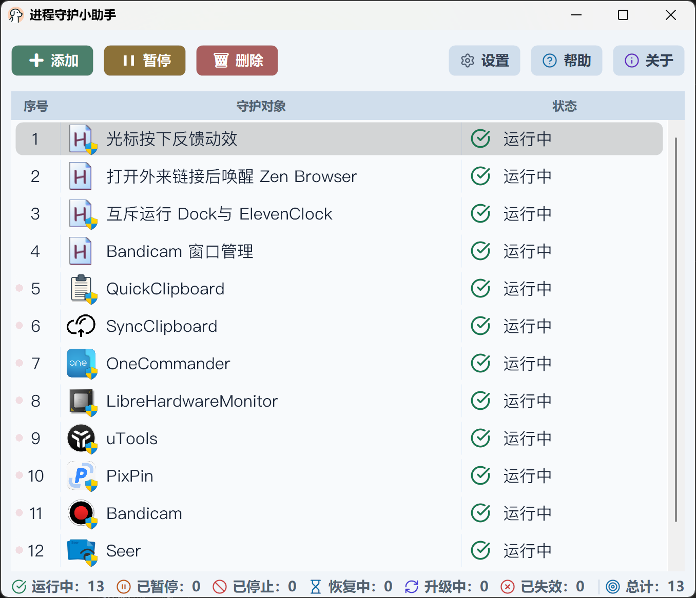

<div align="center">
  

  <p><a href="../README.md">简体中文</a> · <a href="./README.zh-HK.md">繁體中文（香港）</a> · <a href="./README.zh-TW.md">繁體中文（台灣）</a> · <a href="./README.en.md">English</a> · <a href="./README.ja.md">日本語</a> · <a href="./README.vi.md">Tiếng Việt</a> · <strong>한국어</strong> · <a href="./README.es.md">Español</a> · <a href="./README.fr.md">Français</a> · <a href="./README.pt-BR.md">Português</a> · <a href="./README.ru.md">Русский</a> · <a href="./README.de.md">Deutsch</a> · <a href="./README.it.md">Italiano</a></p>

  <h1>프로세스 감시 도우미</h1>

  <p><strong>중요한 앱과 자동화 작업을 꾸준히 지켜 일상의 안정적인 운영을 돕습니다</strong></p>

  <p>
    <a href="https://github.com/realSilasYang/process-watchdog/releases/latest"></a>
    <a href="https://github.com/realSilasYang/process-watchdog/releases"></a>
    <a href="https://github.com/realSilasYang/process-watchdog/actions/workflows/ci.yml"></a>
    <a href="../LICENSE"></a>
    
  </p>

  <p>
    <a href="#화면-개요">화면 개요</a> ·
    <a href="#사용자-안내서">사용자 안내서</a> ·
    <a href="#3-상태와-복구">상태 설명</a> ·
    <a href="https://github.com/realSilasYang/process-watchdog/releases">릴리스</a> ·
    <a href="./CHANGELOG.en.md">변경 기록</a> ·
    <a href="https://github.com/realSilasYang/process-watchdog/issues/new/choose">문제 신고</a> ·
    <a href="#개발자-안내서">개발자 안내서</a>
  </p>
</div>

프로세스 감시 도우미는 현재 Windows 데스크톱 세션에서 장시간 계속 실행해야 하는 앱, 스크립트, 바로 가기를 위한 도구입니다. 대상이 예기치 않게 종료되면 “중지 확인”과 “일시적으로 판단할 수 없음”을 구분하면서 신중하게 자동 복구하여 중복 실행과 잘못된 실행을 막습니다. 판단 결과, 설정, 로그는 모두 로컬 컴퓨터에만 남습니다. AutoHotkey v2 x64로 빌드되며 Windows 10과 Windows 11을 지원합니다.

프로세스 이름만으로 실행 여부를 판단하지 않습니다. 실행 파일 전체 경로, 프로세스 생성 식별 정보, 바로 가기의 실제 대상, 명령줄 근거를 함께 사용합니다. 근거가 부족하면 다음 확인을 기다리며, 불명확한 상태를 중지로 간주해 새 인스턴스를 실행하지 않습니다.

라이트 및 다크 UI, 자동 복구, 소프트웨어 업데이트 보호, 실행 로그, 실행 취소와 다시 실행, 표시 이름과 아이콘 사용자 지정 기능을 제공합니다. Windows x64 배포 패키지에는 SPDX SBOM, SHA-256 체크섬, 빌드 출처 정보도 포함됩니다.

# 화면 개요

<p align="center">
  
</p>

<p align="center">
  
</p>

기본 창은 감시 대상 순서, 앱 아이콘, 이름, 권한 요구 사항, 현재 상태를 한곳에 보여 줍니다. 명령 모음에는 추가, 삭제, 일시 중지, 설정, 도움말, 정보가 있으며, 도움말에서 사용 설명서, 실행 로그, 피드백 페이지를 선택할 수 있습니다. 정보에는 버전, 실행 환경, 업데이트, 프로젝트, 후원 작업이 모여 있습니다. 아래쪽에는 실행, 복구, 업데이트, 일시 중지, 실패 대상 수가 표시되고, 비정상 상태의 판단 근거는 실행 로그에서 확인할 수 있습니다.

## 주요 기능

- EXE, AHK, Python, JavaScript, PowerShell, BAT, CMD, LNK 대상 감시.
- `Running`, `Stopped`, `Unknown` 3상태 확인. 알 수 없는 결과는 무조건 다시 시작하지 않습니다.
- 대상마다 독립된 컨트롤러, 세대, 작업 토큰을 사용하여 일시 중지, 삭제, 경로 변경 뒤의 오래된 콜백을 즉시 무효화합니다.
- 관리자 권한 요구 사항을 항목별로 지정할 수 있습니다. 실행 중 인스턴스의 권한이 맞지 않으면 알리고, 다음 감시 시작은 설정에 따라 승격합니다.
- 업데이트 보호는 기본적으로 꺼져 있습니다. 켜면 업데이트 프로세스, 부모-자식 관계, 설치 폴더 활동, 파일 안정성을 종합해 감시를 멈추거나 다시 시작합니다.
- 구성을 원자적으로 교체합니다. 해석할 수 없는 감시 레코드는 조용히 버리지 않고 `[Recovery]`로 옮깁니다.
- 앱 검색에는 Everything 서비스만 사용하며 자체 전체 디스크 검색이나 결과 개수 제한은 없습니다. 결과가 많으면 아이콘 추출이 UI를 오래 점유하지 않도록 짧은 묶음으로 추가합니다.
- 중국어 간체, 중국어 번체(홍콩), 중국어 번체(대만), 영어, 일본어, 베트남어, 한국어, 스페인어, 프랑스어, 브라질 포르투갈어, 러시아어, 독일어, 이탈리아어를 지원합니다. 기본적으로 Windows 표시 언어를 따르고 지원하지 않는 언어는 영어로 돌아가며, 표시 설정에서 직접 선택할 수도 있습니다. 언어와 콘텐츠 글꼴 변경은 현재 프로세스에 즉시 적용되고 감시 작업을 중지하거나 다시 초기화하지 않습니다.
- “언어 기본값 따르기”에서는 Windows에 설치된 글꼴만 사용합니다. 먼저 PingFang, SF Pro Text, Harano Aji Gothic, Apple SD Gothic Neo를 시도하고 해당 Noto 글꼴과 Windows 시스템 글꼴 순으로 대체합니다. 선택 글꼴은 먼저 Windows에 설치해야 하며, 도우미 자체 폴더에서 비공개로 불러오지 않습니다. 콘텐츠 글꼴은 본문, 입력란, 목록, 정보 페이지에 적용되며 버튼, 설정 탭, 기본 창 상태 표시줄은 현재 언어의 Windows 시스템 UI 굵은 글꼴을 사용합니다.
- 라이트/다크 UI, 하위 창의 독립 최소화, DPI 대응 아이콘 재구축, 둥근 모서리 버튼, 사용자 지정 아이콘을 지원합니다.
- 진단 패키지는 로컬에서만 만들며 자동으로 업로드하지 않습니다. 정식 산출물은 출처와 무결성을 독립적으로 검증할 수 있습니다.

## 적용 범위

현재 Windows 데스크톱 세션에서 계속 실행하고 예기치 않은 종료 뒤에 자동 복구하려는 일반 앱, 스크립트, 바로 가기에 적합합니다. 다음 항목은 현재 범위에 포함되지 않습니다.

- Windows 서비스, 드라이버, 커널 구성 요소, 사용자 세션을 넘는 서비스.
- Windows 7, 32비트 Windows, Windows 이외의 운영 체제.
- 하드 실시간 시스템, 고가용성 클러스터, 보안 격리가 필요한 프로세스 오케스트레이션.
- 알 수 없는 모든 프로세스 상태를 강제로 중지로 보는 공격적인 복구 정책.

Windows 11 실제 환경의 200% DPI에서 전체 GUI 자동화 실행을 기록했으며, 100%와 300% 렌더링 계산은 회귀 테스트로 확인합니다. 모든 배율의 수동 시각 점검, 모니터 간 연속 DPI 전환, 고대비는 아직 검증되지 않았으므로 코드만으로 통과했다고 판단해서는 안 됩니다. [GUI 검증 기록](../tests/gui/VALIDATION-EVIDENCE.en.md)과 [호환성과 알려진 제한](en/compatibility.md)을 확인하세요.

---

**[사용자 안내서](#사용자-안내서)**<br>
[설치](#1-설치와-첫-실행) · [항목 관리](#2-항목-추가와-관리) · [상태](#3-상태와-복구) · [업데이트 보호](#4-업데이트-보호) · [설정](#5-설정) · [로그](#6-로그-진단-개인정보)

**[개발자 안내서](#개발자-안내서)**<br>
[디렉터리](#1-디렉터리와-책임) · [정확성 경계](#2-정확성-경계) · [검증](#3-검증-명령) · [릴리스](#4-릴리스와-기여)

# 프로젝트 후원

문제를 찾거나 앱을 복구하는 시간을 줄이는 데 도움이 되었다면 아래 QR 코드로 개발자를 후원해 주세요. 후원 방법을 선택해 주세요:

<p align="center">
  
  &nbsp;&nbsp;&nbsp;&nbsp;
  
</p>

# 사용자 안내서

## 1. 설치와 첫 실행

1. [Releases](https://github.com/realSilasYang/process-watchdog/releases)에서 전체 포터블 ZIP 또는 전체 소스 ZIP을 선택합니다. 선택적 글꼴 패키지는 세 번째 프로그램 버전이 아닙니다.
2. 포터블 ZIP은 완전히 푼 폴더에서 실행하며 AutoHotkey가 필요 없습니다. 소스 ZIP에는 AutoHotkey v2 x64가 필요합니다. 글꼴은 Windows에 설치해야 하지만 실행에 필수는 아니며, 프로그램 검색에는 별도로 [Everything 공식 최신 버전](https://www.voidtools.com/downloads/)이 필요합니다.
3. `进程守护小助手.exe`를 실행합니다. 앱이 관리자 권한을 요청한 뒤 설정에 따라 기본 창을 표시하거나 시스템 트레이에 머뭅니다.
4. 추가를 눌러 대상을 선택하거나 지원 파일을 기본 창으로 끌어 놓습니다.
5. 로그에서 실제 사용한 식별 근거, 상태 확인, 복구 시도, 업데이트 신호를 확인합니다.

소스에서 실행하려면 AutoHotkey v2 x64를 설치하고 `进程守护小助手.ahk`를 실행합니다. Git으로 저장소를 복제했다면 Git LFS도 설치한 뒤 `git lfs pull`을 실행하여 포인터가 아닌 전체 글꼴 파일을 받아야 합니다. Release에 첨부된 소스 ZIP에는 해당 파일이 이미 들어 있으므로 Git LFS가 필요하지 않습니다. 정식 배포판은 전체 릴리스 테스트를 통과한 AutoHotkey 런타임을 포함하므로 일반 사용자는 별도로 설치할 필요가 없습니다.

### 버전과 실행 형식

| 구성 요소 | EXE판 | 소스판 |
| --- | --- | --- |
| 도우미 | EXE 파일 버전 사용. 업데이트할 때 전체 배포 패키지를 교체 | 진입 파일 옆 `VERSION` 사용. 안전한 Git fast-forward 또는 소스 패키지로 업데이트 |
| AutoHotkey | 내장되어 있으며 이후의 전체 도우미 패키지와 함께 업데이트 | 로컬 인터프리터 사용. 도우미 업데이트가 AutoHotkey를 대신 업데이트하지 않음 |
| Ahk2Exe | 정식 릴리스에서 EXE를 만들 때만 사용하며 사용자 PC에 설치되지 않음 | 필요 없음 |

“도우미가 최신 버전”과 “로컬 AutoHotkey가 최신 버전”은 서로 다른 말입니다. 정식 릴리스를 시작할 때 최신 안정 AutoHotkey와 최신 공개 Ahk2Exe를 선택해 고정하고 전체 테스트를 마친 뒤 선택한 AutoHotkey를 EXE에 포함합니다. 도우미 설정 → 정보에서 도우미 버전, EXE/소스 형식, 실제 AutoHotkey 버전을 함께 확인하고 수동 업데이트 확인도 할 수 있습니다. [버전, 실행 형식, 업데이트 책임](en/versioning.md)을 참조하세요.

기본 창을 닫아도 시스템 트레이로 숨겨질 뿐 감시는 계속됩니다. 완전히 끝내려면 트레이 메뉴의 종료를 사용하세요. 바로 가기, 예약 시작, 업그레이드는 [설치, 업그레이드, 제거](en/installation.md)를 참조하세요.

## 2. 항목 추가와 관리

| 버튼 | 기능 |
| --- | --- |
| 추가 | 대상 선택, 설치된 앱 검색 또는 폴더 가져오기. 기본적으로 하위 폴더 포함 |
| 삭제 | 선택한 감시 대상 삭제. 다중 선택과 실행 취소 지원 |
| 일시 중지 / 재개 | 자동 감시만 전환하고 현재 실행 중인 대상은 종료하지 않음. 혼합 선택은 항목별 반전 |
| 설정 | 표시, 시작, 모니터링, 중지 정책, 로그 설정 |
| 도움말 | 내장 사용 설명서, 실행 로그 또는 GitHub 피드백 페이지 선택 |
| 정보 | 버전과 실행 환경 확인, 업데이트 확인, 프로젝트 열기 또는 후원으로 이동 |

항목마다 시작 진입점, 작업 디렉터리, 인수, 관리자 권한 요구 사항을 설정할 수 있습니다. LNK는 시작 진입점으로 유지하고 실제 프로그램 경로는 프로세스 식별을 위해 따로 저장하므로, 설치 프로그램이 만든 간접 바로 가기를 쉽게 바뀌는 내부 EXE로 직접 고칠 필요가 없습니다.

목록에서 마우스 오른쪽 버튼을 눌러 파일 위치 열기, 대상 실행 종료, 대상 경로 편집, 프로세스 식별 및 실행 설정, 관리자 요구 사항 전환, 업데이트 보호 설정을 할 수 있습니다. 실행 종료는 감시도 일시 중지하여 대상이 자동으로 다시 시작되지 않게 합니다. 기본 창에만 적용되는 이름과 아이콘도 바꿀 수 있으며 대상 식별, 시작, 업데이트 보호에는 영향을 주지 않습니다. 이미 기본 표시라면 기본값 복원 명령은 비활성화됩니다.

BAT 및 CMD 항목에만 배치 출력 로그 보기 명령이 추가로 표시되며 다른 대상 유형에는 나타나지 않습니다. 별도 로그 파일은 도우미가 해당 배치 항목을 실제로 시작하고 표준 출력과 표준 오류를 캡처한 경우에만 생성됩니다. 이미 실행 중인 배치 프로세스에는 자동으로 생성되지 않습니다.

행을 끌어 순서를 바꾸면 저장됩니다. `Ctrl+Z`, `Ctrl+Y`, `Ctrl+Shift+Z`로 추가, 삭제, 정렬, 구성 변경을 실행 취소하거나 다시 실행할 수 있습니다. 왼쪽 번호는 표시 순서에 따라 다시 매겨지며 식별, 시작, 저장에는 사용되지 않습니다. [일반적인 사용 예](en/quick-start.md)도 참조하세요.

## 3. 상태와 복구

목록 상태는 현재 확보한 근거와 다음 동작을 뜻합니다. 아이콘 색만으로 결과를 판단하지 마세요.

| 상태 | 의미 |
| --- | --- |
| 실행 중 | 대상 식별 정보와 일치하는 실행 중 인스턴스를 찾음 |
| 실행 중(권한 불일치) | 인스턴스는 있으나 설정된 관리자 요구 사항을 충족하지 않음 |
| 프로세스 상태 대기 / 중지 의심 | 근거가 부족하거나 종료 직후라 재확인 중. 즉시 중복 실행하지 않음 |
| 시작 / 재시도 카운트다운 | 복구가 필요하다고 확인되어 지연 순서에 따라 다음 시도를 기다림 |
| 업데이트 중 / 파일 안정성 확인 | 업데이트 활동 종료와 대상 파일 안정까지 자동 시작을 보류 |
| 일시 중지됨 | 자동 확인과 복구는 멈췄지만 대상 프로세스는 종료하지 않음 |
| 중지 / 시작 실패 / 대기 시간 초과 | 복구되지 않았거나 확인 필요. 정확한 근거와 원인은 로그 참조 |

기본 재시도 지연은 1초, 10초, 60초입니다. 빠른 순서를 모두 사용하면 마지막 지연을 반복해 과도한 실행 루프를 막습니다. 삭제, 일시 중지, 경로 변경, 실행 취소 시 오래된 예약 작업과 비동기 결과가 무효화됩니다.

## 4. 업데이트 보호

업데이트 보호는 기본적으로 꺼져 있으며 항목별로 직접 켭니다.

1. 대상을 마우스 오른쪽 버튼으로 누르고 업데이트 보호를 엽니다.
2. 업데이트 자동 감지 및 시작 보호를 켭니다.
3. 설치 범위, 종료 감지 구간, 파일 안정 대기, 최대 업데이트 대기를 확인합니다.
4. 저장한 뒤 앱이 실제 업데이트를 평소 방식으로 한 번 수행하게 합니다. 도우미는 업데이트 프로세스, 부모-자식 관계, 설치 폴더 활동, 파일 알림, 학습한 업데이트 프로그램 특성을 합쳐 보호 시작을 판단합니다.

업데이트가 확인되면 자동 시작을 보류하고, 활동이 끝나고 대상 파일이 안정된 뒤 일반 감시로 돌아갑니다. 감지가 시간 초과되거나 실제와 다르면 같은 화면에서 업데이트 대기를 끝내고 감시를 재개할 수 있습니다. 복구 전에도 시작 진입점이 안전한지 확인합니다.

이 기능은 범용 설치 프로그램이나 Windows 서비스 관리자가 아닙니다. 포터블 앱, 설치 폴더 밖의 업데이트 프로그램, 특수 실행기는 먼저 실행 로그를 확인한 뒤 범위와 규칙을 조정하세요.

## 5. 설정

| 분류 | 옵션 |
| --- | --- |
| 표시 | UI 언어, 콘텐츠 글꼴, 테마 |
| 시작 | 바탕 화면/시작 메뉴 바로 가기, 예약 자동 시작, 두 가지 시작 동작 |
| 모니터링 | 프로세스 확인 간격, 충돌 후 자동 재시작 지연 순서, 폴더 가져오기 시 하위 폴더 포함 여부 |
| 중지 정책 | GUI/CLI 앱 종료 시간 제한과 초과 뒤 강제 종료 허용 여부 |
| 로그 | 시작할 때 지우기, 실행 로그 표시 한도, 일괄 로그 보존 일수, 저장 경로 |

설정 창은 숫자 범위를 검사합니다. `watchdog.ini`의 주석은 해당 구역과 항목 옆에 있습니다. 인코딩된 필드를 손상하지 않도록 가능하면 UI에서 수정하세요. [구성, 백업, 복구](en/configuration.md)를 참조하세요.

## 6. 로그, 진단, 개인정보

실행 로그는 텍스트 선택과 복사, 최대화, 창 크기 조정을 지원합니다. 스크롤 막대는 필요할 때만 나타나고 로그 자체는 편집할 수 없습니다.

원인을 찾기 어려우면 로그 창에서 로컬 진단 패키지를 내보낼 수 있습니다. 앱, Windows, AutoHotkey, DPI, 리소스 핸들, 감시 단계, 구성 경고, 현재 로그 요약을 포함하지만 자동으로 업로드하지 않습니다.

개인 설정은 실제 실행 디렉터리의 `watchdog.ini`에, 끝나지 않은 업데이트 세션은 같은 위치의 `watchdog.maintenance.ini`에 저장합니다. 포터블판과 소스판은 각 진입 디렉터리를 사용합니다. 두 파일은 릴리스에 포함되거나 업데이트 때 덮어쓰이지 않습니다.

포터블 EXE와 소스 진입점은 같은 폴더에 있을 때만 상태를 공유합니다. 독립 EXE는 다운로드한 실행 파일 옆의 설정을 사용하지 않습니다. 시스템 전체 단일 인스턴스 잠금은 여러 형식의 동시 실행을 막고, 바로 가기와 예약 작업은 마지막으로 통합한 실제 실행 형식을 가리킵니다. [구성, 백업, 복구](en/configuration.md) 및 [설치, 업그레이드, 제거](en/installation.md)를 참조하세요.

로그와 진단 패키지에는 대상 경로, 시작 인수, 환경 변수가 포함될 수 있습니다. 공개 게시 전에 검토하고 민감한 내용을 가리세요. 일반 신고는 [구조화된 Issue 양식](https://github.com/realSilasYang/process-watchdog/issues/new/choose)을 사용하고, 해결되지 않은 보안 문제는 비공개 취약점 신고를 이용하세요. [로컬 진단](en/diagnostics.md), [문제 해결](en/troubleshooting.md), [지원](../.github/SUPPORT.en.md)도 참조하세요.

# Star History

[](https://star-history.com/#realSilasYang/process-watchdog&Date)

# 개발자 안내서

## 1. 디렉터리와 책임

```text
process-watchdog/
├─ .github/                 Issue 양식, 워크플로, 공동 작업 템플릿
├─ app/                     앱 상태, UI 연결, 각 창
├─ assets/                  아이콘, 후원 이미지, 프로세스 전용 글꼴
├─ config/                  항목별 주석이 있는 현재 구성 예제
├─ docs/                    사용자, 설계, 다국어, 이미지, 프로젝트 운영 문서
├─ src/                     구성, 핵심, 진단, 실행, 검사, 업데이트 보호, 플랫폼, UI, 자동 업데이트
├─ runtime/                 EXE/소스 공용 백그라운드 업데이트 도우미
├─ tests/                   핵심, GUI, 릴리스, 저장소 검증
├─ third_party/             고정 DLL, 라이선스, 종속성 목록
├─ tools/                   빌드, SBOM, 릴리스 검증, 도구 체인 준비
└─ 进程守护小助手.ahk      구성 루트 및 시작 진입점
```

루트 스크립트는 모듈 포함, 종속성 조립, 앱 시작만 담당합니다. `src`는 루트 전역 `App`, `Main`, `GuiModules`를 읽지 않고, `app`이 순수 핵심 기능을 창, 로그, 시스템 작업에 연결합니다. [아키텍처와 정확성 경계](en/architecture.md)를 참조하세요.

## 2. 정확성 경계

- 대상 식별, 시작 진입점, 기본 창 표시 사용자 지정은 독립적이며 표시 설정이 감시 판단을 바꾸면 안 됩니다.
- `Running`, `Stopped`, `Unknown`은 외부 근거 결과이며, 중지가 확인된 경우에만 복구를 시작합니다.
- 타이머, 메시지 콜백, 파일 감시기, 작업 프로세스, 창, 네이티브 리소스마다 반복 실행해도 안전한 정리 경로가 필요합니다.
- 구성 스냅샷, 감시 대상, 업데이트 보호 설정은 같은 트랜잭션에서 반영하며 테스트가 개인 `watchdog.ini`를 읽거나 덮어쓰면 안 됩니다.
- 폐기한 GDI 화면 캡처 오버레이 방식의 부드러운 스크롤을 다시 도입하지 않고 ListView와 로그는 기본 스크롤을 유지합니다.
- DPI, 아이콘, 다크 모드, 창 계층, 접근성 주장은 실제 Windows와 배율 검증 근거가 필요하며 자동화가 물리적 디스플레이 행렬을 대신할 수 없습니다.

## 3. 검증 명령

```powershell
powershell -NoProfile -ExecutionPolicy Bypass -File .\tests\verify.ps1
powershell -NoProfile -ExecutionPolicy Bypass -File .\tests\verify-windows-integration.ps1 `
  -SoakSeconds 10
powershell -NoProfile -ExecutionPolicy Bypass -File .\tests\reproducible-build.ps1
```

`verify.ps1`은 종속성 해시, AHK 구문 분석, 정적 설계 제약, 핵심 테스트, 저장소 경계, 전체 Git 기록 유출, 워크플로 구문, 시작 동작을 검사합니다. `verify-windows-integration.ps1`은 전체 글꼴을 검증하고 실제 Windows 컨트롤에서 13개 언어, 3단계 창, GDI/USER 핸들 회수를 확인합니다. `reproducible-build.ps1`은 세 배포판과 SBOM을 두 번 빌드해 체크섬을 비교합니다.

AutoHotkey와 Ahk2Exe는 저장소에서 미리 고정하지 않습니다. 수동 정식 릴리스마다 최신 안정 AutoHotkey와 최신 공개 Ahk2Exe를 조회하고 하나의 해석 결과를 고정한 뒤 같은 결과로 테스트, 이중 빌드, SBOM, 패키징을 수행합니다. actionlint, Gitleaks 같은 검증 전용 도구는 버전을 고정합니다. 실제 버전, 출처, 커밋, SHA-256은 릴리스에 저장합니다. [타사 소프트웨어 고지](project/THIRD_PARTY_NOTICES.en.md)를 참조하세요.

## 4. 릴리스와 기여

사용자가 볼 수 있는 변경 사항은 모든 현지화 README와 변경 기록에 반영해야 합니다. 새 버전에는 [변경 기록 템플릿](en/changelog-template.md)을 사용하며 커밋 메시지나 내부 클래스 이름을 복사하지 말고 사용자가 관찰할 수 있는 추가, 개선, 수정으로 정리합니다.

[릴리스 절차](en/release-process.md)와 [공개 전 점검표](en/publication-checklist.md)를 참조하세요. 일반 Pull Request는 버전 태그를 만들거나 공개된 태그를 바꾸면 안 됩니다. Issue와 Pull Request에는 재현 방법, 위험, 검증 근거를 포함하고 창, DPI, 아이콘, 다크 모드 관련 내용은 실제 확인한 Windows 버전과 배율도 적어 주세요. [기여 안내](../.github/CONTRIBUTING.en.md)와 [프로젝트 운영](project/GOVERNANCE.en.md)을 참조하세요.

프로젝트 코드는 [MIT License](../LICENSE)로 공개됩니다. 내장 및 번들 구성 요소에는 각자의 라이선스가 적용되며, 배포 패키지에는 AutoHotkey 라이선스와 해당 소스 보관 파일이 포함됩니다. PingFang, SF Pro Text, Apple SD Gothic Neo는 프로젝트 소유자가 보유한 상업적 재배포 권한에 따라 제공되며 MIT License 대상이 아닙니다.
